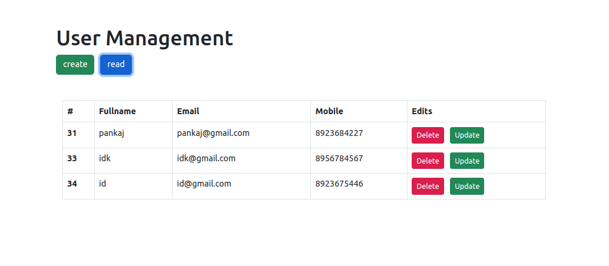
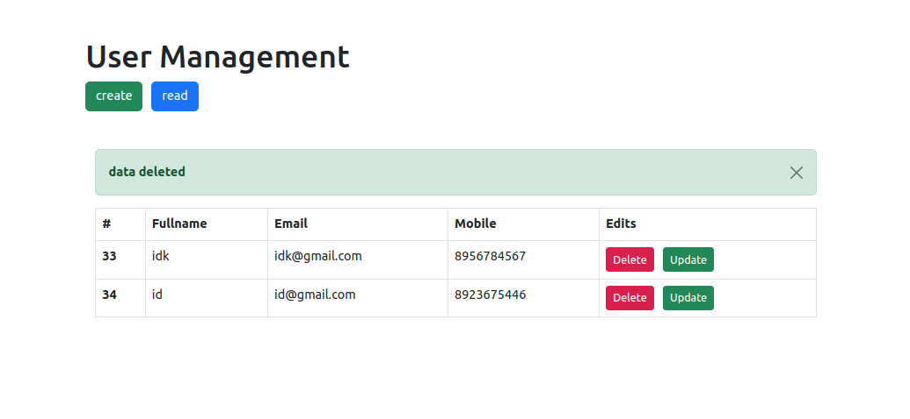

# CURD APP
## TECH STACK USED TO BUILT
- #### Backend : Nodejs, MySQL
- #### Frontend : Angularjs, Typescript, Bootstrap
## Setup Database
`Setup Mysql Database and Modify the config in index.js file at line 14`

## Run Locally
### Clone the Repo
```
git clone git@github.com:Pankaj-SinghR/CURD-App-NodeJs-AngularJs.git
```
## Change directory to backend server
```
cd CURD-App-NodeJs-AngularJs/curd-app/backend
```

## Run Node server AngularJs

```
node index.js
```
`server will start on port 3000`

## Screenshot of UI




